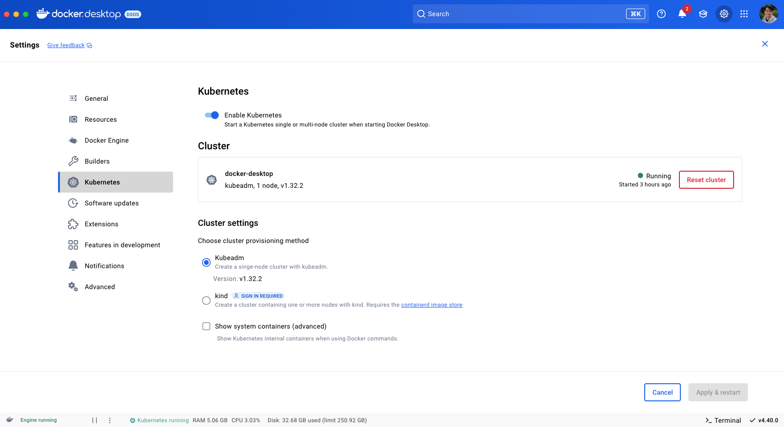
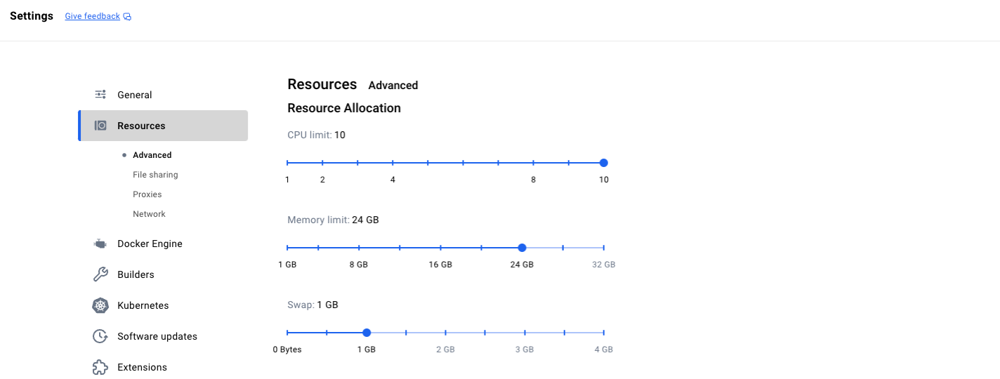

<!-- TOC -->
* [Introduction](#introduction)
* [Docker Desktop](#docker-desktop)
  * [Install Required Software](#install-required-software)
  * [Configure Kubernetes cluster in Docker Desktop](#configure-kubernetes-cluster-in-docker-desktop)
  * [Deploy Selenium Grid solution using Helm chart](#deploy-selenium-grid-solution-using-helm-chart)
      * [Deploy PVC for video recording and video manager storage.](#deploy-pvc-for-video-recording-and-video-manager-storage)
      * [Add Docker Selenium Helm chart repository](#add-docker-selenium-helm-chart-repository)
      * [Install latest chart with reference values.](#install-latest-chart-with-reference-values)
      * [Verify Grid installation](#verify-grid-installation)
      * [Browser Nodes in autoscaling from zero mode.](#browser-nodes-in-autoscaling-from-zero-mode)
      * [Run a test in Grid](#run-a-test-in-grid)
<!-- TOC -->

# Introduction

This directory contains the reference values for the Helm charts in the `charts` directory. The reference values are used to test the Helm charts and ensure that they are working correctly. The reference values are stored in YAML files, which can be used to generate the expected output of the Helm charts.

# Docker Desktop

## Install Required Software

_Note: This guide is for macOS. For other operating systems, please refer to particular tool documentation._
```sh
brew install docker kubectl helm
```

Verify the installation
```sh
java -version
docker --version
kubectl version --client
helm version
```

## Configure Kubernetes cluster in Docker Desktop

Most users are able to installed Docker Desktop and start Kubernetes cluster in settings as below.



If you are having a local machine with good resources, configure Docker Desktop to use more resources. Then you can install orchestration containers with autoscaling capability.



Open a terminal, ensure `kubectl` is able to connect to the cluster

```sh
kubectl cluster-info
```

## Deploy Selenium Grid solution using Helm chart

#### Deploy PVC for video recording and video manager storage.

Checkout file [local-pvc-docker-desktop.yaml](local-pvc-docker-desktop.yaml)

```sh
kubectl apply -f local-pvc-docker-desktop.yaml
```

#### Add Docker Selenium Helm chart repository

```sh
helm repo add docker-selenium https://www.selenium.dev/docker-selenium
helm repo update
```

#### Install latest chart with reference values.

Checkout file [simplex-docker-desktop.yaml](simplex-docker-desktop.yaml)

```sh
helm upgrade -i selenium docker-selenium/selenium-grid \
  --namespace default \
  -f simplex-docker-desktop.yaml
```

#### Verify Grid installation

- Grid components in cluster: `kubectl get pod -n default`
- Grid UI: [http://localhost/selenium](http://localhost/selenium)
- Recordings manager: [http://localhost/recordings](http://localhost/recordings)

#### Browser Nodes in autoscaling from zero mode.

There is no Node visible on Grid UI. The browser nodes are created on demand when a test is started. The browser nodes are automatically removed when the test is finished.

#### Run a test in Grid

Refer to [get_started.py](../../get_started.py) for a simple test using Python and Selenium. The test will run remotely on the Grid.

- Check the Grid UI to see the test running.
- Check the Recordings manager to see the video recording of the test.
- Check if the test passed or failed.
